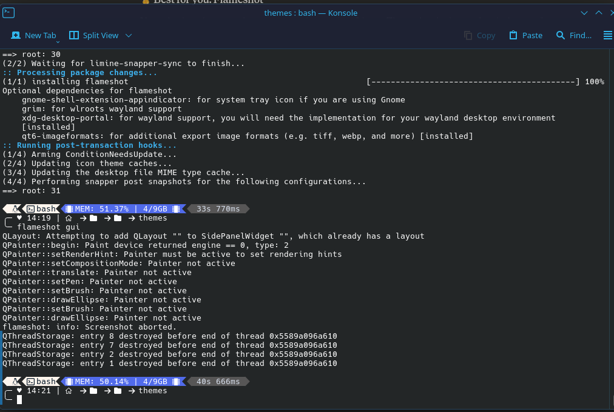
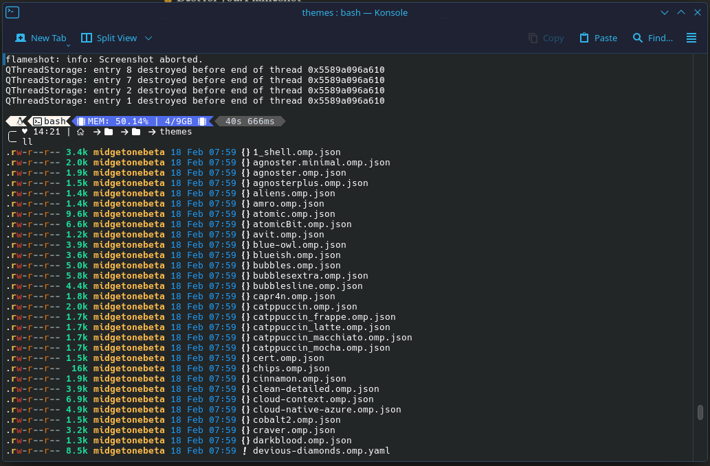

# CachyOS Terminal Setup

A pair of scripts to set up and reset a fully customized terminal environment on CachyOS, featuring Oh My Posh theming across Fish, Zsh and Bash.

---

## 📋 Requirements

Before running either script make sure you have the following:

- **CachyOS** installed (Arch-based)
- **Oh My Posh** installed (`paru -S oh-my-posh-bin`)
- **Your theme file** located at:
  ```
  /home/$USER/Templates/oh my posh/themes/Maintheme/clean-detailed.omp.json
  ```
- **paru** AUR helper installed (comes with CachyOS by default)

---

## 📁 Files

| File | Description |
|------|-------------|
| `setup-terminal.sh` | Sets up all shells with Oh My Posh, aliases, plugins and tools |
| `reset-terminal.sh` | Resets all shells back to CachyOS defaults |

---

## 🚀 Setup Script (`setup-terminal.sh`)

### What it does
- Checks if Oh My Posh is installed
- Installs required packages: `tree`, `fzf`, `bat`, `eza`, `fd`, `ripgrep`, `htop`, `zsh-autosuggestions`, `zsh-syntax-highlighting`, `zsh-autocomplete`
- Configures **Fish**, **Zsh** and **Bash** with:
  - Oh My Posh theme (`clean-detailed`)
  - Better history settings
  - Syntax highlighting and autosuggestions
  - Navigation shortcuts (`..`, `...`, `....`)
  - Git shortcuts (`gs`, `gcm`, `gph`, `gpl`)
  - Useful aliases (`ll`, `la`, `lt`, `cat`, `update`, `install` etc.)
  - `up` function to jump multiple directories
  - `mkcd` to create and enter a folder in one command
  - `whereis` to find where a command is located
  - FZF fuzzy history search (`Ctrl+R`)

### How to run
```bash
# Make it executable
chmod +x setup-terminal.sh

# Run it
./setup-terminal.sh
```

### After running
Restart your terminal or reload each shell manually:
```bash
source ~/.config/fish/config.fish   # Fish
source ~/.zshrc                      # Zsh
source ~/.bashrc                     # Bash
```

---

## 🔄 Reset Script (`reset-terminal.sh`)

### What it does
- Asks for confirmation before making any changes
- **Backs up** your current configs to `~/.config/shell-backup-[timestamp]` so you can always recover them
- Restores **Fish**, **Zsh** and **Bash** back to CachyOS defaults

### How to run
```bash
# Make it executable
chmod +x reset-terminal.sh

# Run it
./reset-terminal.sh
```

### Recovering from backup
If you want to restore your custom setup after a reset, your backups are saved at:
```
~/.config/shell-backup-[date-time]/
```
Files inside:
- `.bashrc.bak`
- `.zshrc.bak`
- `config.fish.bak`

---

## 🛠️ Useful Aliases Reference

| Alias | Command |
|-------|---------|
| `ll` | `eza -alF --icons` (detailed file list) |
| `la` | `eza -a --icons` (show hidden files) |
| `lt` | `eza --tree --icons` (tree view) |
| `cat` | `bat` (syntax highlighted cat) |
| `..` | `cd ..` |
| `...` | `cd ../..` |
| `up 2` | Go up 2 directories |
| `gs` | `git status` |
| `gcm` | `git commit` |
| `gph` | `git push` |
| `gpl` | `git pull` |
| `install` | `sudo pacman -S` |
| `update` | `sudo pacman -Syu` |
| `remove` | `sudo pacman -Rsn` |
| `reload` | Reload current shell config |
| `myip` | Show your public IP |
| `weather` | Show current weather |
| `histg` | Search command history |
| `mkcd` | Create folder and enter it |
| `whereis` | Find where a command is located |
| `zshconfig` | Open Zsh config in code-oss |
| `fishconfig` | Open Fish config in code-oss |
| `bashconfig` | Open Bash config in code-oss |

---

## ⚠️ Notes

- The safety aliases for `cp`, `mv` and `rm` are intentionally left out to avoid issues during compiling and build systems
- `zsh-autocomplete` is Zsh only — Fish has it built in natively and Bash uses arrow key history search instead
- The reset script does **not** uninstall any packages, it only restores config files

---
## 📸 Screenshots

### File Tree



### Running Setup



## 📦 Packages Installed by Setup Script

| Package | Purpose |
|---------|---------|
| `tree` | Directory tree visualization |
| `fzf` | Fuzzy finder for history search |
| `bat` | Syntax highlighted cat replacement |
| `eza` | Modern ls replacement with icons |
| `fd` | Fast file finder |
| `ripgrep` | Fast text search tool |
| `htop` | Interactive process viewer |
| `zsh-autosuggestions` | Fish-like suggestions for Zsh |
| `zsh-syntax-highlighting` | Syntax highlighting for Zsh |
| `zsh-autocomplete` | Real-time dropdown autocomplete for Zsh |
=======
# Cachyos-Terminal-Setup
CaschyOs-Oh-My-Posh install and removal.
>>>>>>> 3f72797bab3d64ef0c91604d3227b0dfea4b5185
